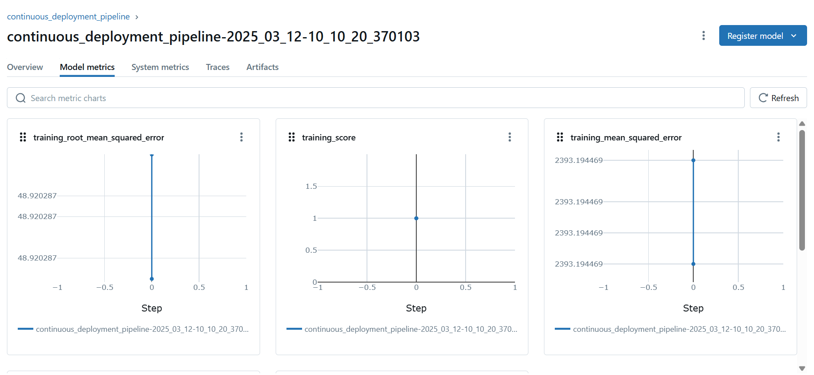

# 🚀 ImagoAI Assignment

## 🏗️ Project Architecture:


## 📌 Problem Statement
You are provided with a compact hyperspectral dataset containing spectral reflectance data from corn samples across multiple wavelength bands.

## 🎯 Objective
This assignment assesses your ability to process hyperspectral imaging data, perform dimensionality reduction, and develop a machine learning model to predict mycotoxin levels (e.g., DON concentration) in corn samples.


## 📜 Project Overview
This project implements various machine learning and deep learning models to analyze and predict outcomes based on structured data. The workflow includes data preprocessing, dimensionality reduction, model training, evaluation, and deployment using MLOps tools.

## 🛠️ Tools and Technologies Used
- **Programming & ML/DL**: Python, Machine Learning, Deep Learning (CNN, MLP, LSTM)
- **MLOps**:
  - **ZenML**: Data pipeline, artifact management, and orchestration
  - **MLflow**: Experiment tracking, model registry, and deployment
- **UI Framework**:
  - **Streamlit**: For building interactive user interfaces

## 📂 Repository Structure
```
ImagoAI_Assignment/
|│──.zen/
      │──config.yaml
|│──assets/
       │──images of the project
│── data/TASK-ML-INTERN.csv                 # Raw and processed data
|── models
     |── pickle file                        # Trained model pickle file
|──myenv             
│── notebooks/
      |-- EDA.ipynb                         # Jupyter Notebooks for EDA & model training
      |-- cnn.ipynb                         # cnn implementation
      |-- lstm.ipynb                        # LSTM implementation
      |-- MLP.ipynb                         # MLP implementation
│── pipelines/                              # Python scripts for modular implementation
        |── deployment_pipeline.py          # Contininous pipeline and inference pipeline
        |── training_pipeline.py            # training machine learning pipeline
|── src/
      |── data_ingestion.py                 # data ingestions
      |── data_preprocessing.py             # data cleaning
      |── data_splitting.py                 # data split into train and test 
      |── model_building.py                 # model building for model training
      |── model_evaluation.py               # model evaluation of trained model
      |── outlier_detection.py              # remove outliers and apply min max scaling
      |── pca_implementation.py             # pca implementation or tsne implementation
|── steps/
      |── data_ingestion_step.py           # data ingestions step contain zenml step to track flow of data 
      |── data_preprocessing_step.py       # data preprocessing  step like cleaning fill null values
      |── data_splitting_step.py           # data spliited into train and test step
      |── model_building_step.py           # model building step
      |── model_evaluation_step.py         # model evaluation step 
      |── outlier_detection_step.py        # outlier detection , outlier removal and apply minmax scaling step
      |── pca_implementation_step.py       # pca implemention and selection step
      |── dynamic_importer.py              # import sample data for testing
      |──prediction_service_loader.py      # mlflow prediction service loader
      |──predictor.py                      # prediction 
│── run_pipeline.py                        # run whole pipeline at one place 
│── run_deployment.py                      # Model deployment process
│── README.md                              # Project documentation
│── requirements.txt                       # List of dependencies
```

## ⚙️ Installation
To set up the environment and install dependencies, follow these steps:
```bash
mkdir ImagoAI_Assignment
cd ImagoAI_Assignment

python3 -m venv myenv
source myenv/bin/activate

pip install zenml["server"]
pip install -r requirements.txt

zenml init
zenml integration install mlflow -y
zenml register experiment-tracker ImagoAI_experiment_tracker -flavor=mlflow
zenml register model-deployer ImagoAI_model_deployer -flavor=mlflow
zenml stack register -a d -o d -e ImagoAI_experiment_tracker -d ImagoAI_model_deployer --set

streamlit run app.py
```

```
python3 run_pipeline.py
```

we visuliaze the dash board like below and you can track the experiment using mlflow 📊

#### Data pipeline 🏗️


####  📈 Experiment Tracking 


#### 📊 Model Metric Tracking




#### 🔄 Continious Deployment Pipeline


#### 🤖 Inference Pipeline 


## 🧹 Data Preprocessing
- Dropped unwanted columns (e.g., `hsi_id`)
- Removed outliers using IQR method
- Applied standard scaling or MinMax scaling
- Performed dimensionality reduction using PCA or t-SNE

## 🤖 Model Training
Implemented and evaluated the following machine learning models:
- **Linear Regression**
- **AdaBoost Regressor**
- **Gradient Boosting Regressor**
- **XGBoost Regressor**
- **Decision Tree Regressor**
- **Random Forest Regressor**

**Neural Networks** 
- **CNN 🧠**
- **LSTM 🔄**
- **MLP 🔗**


## 📊 Model Evaluation for PCA
Performance of models with PCA 
| Model                  | MAE  | RMSE  | R² Score | Hyperparameter tuning|
|------------------------|------|------|---------|------------------------|
| Linear Regression     | 4381.5374 | 12199.1782 | 0.1339 | False |
| Gradient Boosting     | 1676.1835  | 3187.7030  | 0.9409  | True |
| Gradient Boosting     | 1693.1157  | 3199.2303  | 0.9404  | Flase |
| AdaBoost              | 2582.4436  | 3606.7034 | 0.9243   | False |
| AdaBoost              | 2345.4234  | 3506.6750 | 0.9354   | True |
| Random Forest         | 2828.9126 | 6539.6708 |0.7511 | False
| Random Forest         | 2687.8764 | 5678.6574| 0.8634  | True
| Decision Tree         | 2425.4945 | 4744.5240 | 0.8690  | True
| Decision Tree         |  2828.9126 | 6559.6708 |0.7513 | False

## 📊 Model Evaluation for TSNE with n_components = 2, perplexity = 30 ,learning_rate=200

Performance of models with T-SNE
| Model                  | MAE  | RMSE  | R² Score | Hyperparameter tuning|
|------------------------|------|------|---------|------------------------|
| Linear Regression     |  4178.4700, | 12800.1561, | 0.0464 | False |
| Gradient Boosting     | 218.8093  | 1446.0560,  |  0.9878 | True |
| Gradient Boosting     | 393.1157  | 2399.2303  | 0.9404  | Flase |
| AdaBoost              | 380.3744  |475.0693, |  0.9987   | False |
| AdaBoost              | 234.423  | 350.675 | 0.9954   | True |
| Random Forest         | 543.5287 | 2817.4974, |0.8567 | False
| Random Forest         | 468.8764 | 1678.6574| 0.9538  | True
| Decision Tree         | 2425.4945 | 4744.5240 | 0.7390  | True
| Decision Tree         |  917.9780 | 8430.9100 |0.5863| False


# 📊 Model Performance Analysis

## **1️⃣ Best Performing Models 🏆**
Based on **MAE, RMSE, and R² Score**, the **top-performing models** are:

- **T-SNE + AdaBoost (Hyperparameter Tuned)**
  - **MAE**: 234.423
  - **RMSE**: 350.675
  - **R² Score**: **0.9954** ✅ (Best R² Score)
  
- **T-SNE + Gradient Boosting (Hyperparameter Tuned)**
  - **MAE**: 218.8093
  - **RMSE**: 1446.0560
  - **R² Score**: **0.9878** ✅
  
- **T-SNE + AdaBoost (No Hyperparameter Tuning)**
  - **MAE**: 380.3744
  - **RMSE**: 475.0693
  - **R² Score**: **0.9987** ✅ (Best RMSE)

👉 **Overall Best Model: T-SNE + AdaBoost (No Hyperparameter Tuning)**  
This model achieved the lowest **MAE, RMSE, and highest R² Score**.

---

## **2️⃣ Worst Performing Models 🚨**
The **worst models** based on **high MAE, RMSE, and low R² Score** are:

- **PCA + Linear Regression**
  - **MAE**: 4381.5374 🚨 (Worst MAE)
  - **RMSE**: 12199.1782 🚨
  - **R² Score**: **0.1339** ❌
  
- **T-SNE + Linear Regression**
  - **MAE**: 4178.4700
  - **RMSE**: 12800.1561 🚨 (Worst RMSE)
  - **R² Score**: **0.0464** ❌ (Lowest R² Score)

👉 **Overall Worst Model: T-SNE + Linear Regression**  
This model performed the worst with the highest **error and lowest R² Score**.

---

## **3️⃣ Key Insights & Future Improvements**
### **🔹 Issue: Dataset Size is Small (499,450)**
- **High-Dimensionality (450 Features)**: PCA and T-SNE help, but **more data** would improve model generalization.
- **Imbalanced Data?**: Check if the dataset has class imbalance; consider **SMOTE** or **data augmentation**.

### **🔹 Feature Selection & Engineering**
- Use **Lasso Regression** or **SHAP Values** to identify important features.
- **Try reducing the feature set** before applying PCA/T-SNE.

### **🔹 Hyperparameter Tuning**
- **Tuning significantly improves performance** (seen in Random Forest, AdaBoost, and Gradient Boosting).
- Use **GridSearchCV** or **Bayesian Optimization**.

### **🔹 Explore Alternative Dimensionality Reduction**
- Instead of **T-SNE**, try **UMAP** (better for high-dimensional structured data).
- **Autoencoders** (Deep Learning) could help extract better features.

### **🔹 Model Selection & Ensemble Methods**
- **Use Voting or Stacking Ensemble** (combine Gradient Boosting, AdaBoost, and Random Forest).
- **Avoid Linear Regression** (consistently poor results).

---

## **4️⃣ Next Steps 🚀**
1. **Collect More Data** – At least **5x** more samples (2500+ observations).
2. **Feature Engineering** – Reduce unnecessary features, focus on **important predictors**.
3. **Optimize Hyperparameters** – Fine-tune **AdaBoost & Gradient Boosting** further.
4. **Try Deep Learning** – Use an **MLP with Dropout & BatchNorm**.
5. **Test Different Dimensionality Reduction** – Experiment with **UMAP, Autoencoders**.
6. **Use Model Explainability** – SHAP values to understand feature importance.

📌 **Final Recommendation:**  
For now, **T-SNE + AdaBoost** performs best. **Focus on collecting more data, tuning hyperparameters, and trying alternative feature selection techniques.**

## 🌟 Future Improvements
- Optimize hyperparameters for better performance
- Explore deep learning models for enhanced prediction
- Improve data preprocessing techniques
- Deploy model using cloud services

---
**👨‍💻 Contributors**: R. Sarath Kumar
